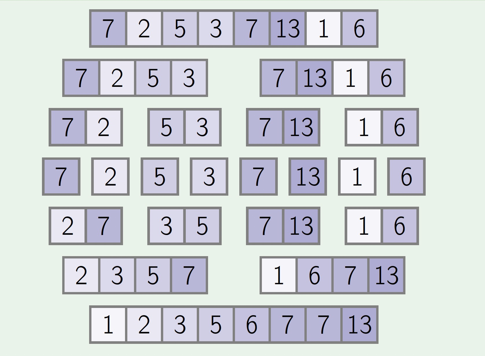
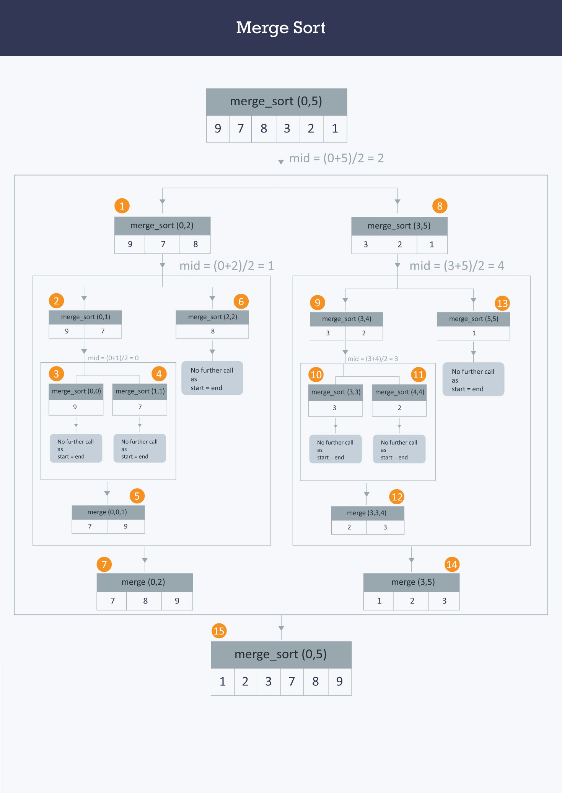

# Merge Sort

```java
void merge(int A[ ] , int start, int mid, int end) {
 //stores the starting position of both parts in temporary variables.
int p = start ,q = mid+1;

int Arr[end-start+1] , k=0;

for(int i = start ;i <= end ;i++) {
    if(p > mid)      //checks if first part comes to an end or not .
       Arr[ k++ ] = A[ q++] ;

   else if ( q > end)   //checks if second part comes to an end or not
       Arr[ k++ ] = A[ p++ ];

   else if( A[ p ] < A[ q ])     //checks which part has smaller element.
      Arr[ k++ ] = A[ p++ ];

   else
      Arr[ k++ ] = A[ q++];
 }
  for (int p=0 ; p< k ;p ++) {
   /* Now the real array has elements in sorted manner including both
        parts.*/
     A[ start++ ] = Arr[ p ] ;
  }
}

void merge_sort (int A[ ] , int start , int end )
   {
           if( start < end ) {
           int mid = (start + end ) / 2 ;           // defines the current array in 2 parts .
           merge_sort (A, start , mid ) ;                 // sort the 1st part of array .
           merge_sort (A,mid+1 , end ) ;              // sort the 2nd part of array.

         // merge the both parts by comparing elements of both the parts.
          merge(A,start , mid , end );
   }
}
```

## Running time

$$
O(n \: log \: n)
$$

- Merge sort uses the divide-and-conquer strategy to sort an n-element array in time O(n log n).




